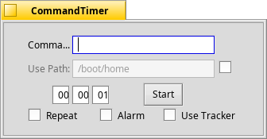

##  CommandTimer
Originally by Jason Scaroni, jscaroni@calpoly.edu

CommandTimer counts down to zero then executes whatever command is in the top box.  I've used it to grab images from web cams, and to shutdown my computer in an hour.  I've also thought of using the CommandTimer to execute a script that mirrors my website.  Anyway, I'm sure you could come up with a lot more uses.



### Usage

* Put whatever command you'd like to run in the *Command* text box, e.g. ```wget http://www.sakoman.com/codycam/codycam.jpg &```
* Use the checkmarks to *Repeat* the countdown or sound an *Alarm* (the system beep, see Haiku's Sounds preferences) when the countdown reaches "0".
* Optionally enter the location in the second text box where the command is to *Execute in*. Can be de/activated with the checkbox at the end.
* Enter the time for the countdown.
* Hit the *Start* button.