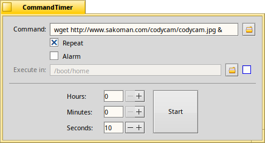

CommandTimer Beta 2.0
By: Jason Scaroni  jscaroni@calpoly.edu

The CommandTimer counts down to zero then executes whatever command is in the top box.  I've used it to grab images from web cams, and to shutdown my computer in an hour.  I've also thought of using the CommandTimer to execute a script that mirrors my website.  Anyway, I'm sure you could come up with a lot more uses.

Installation and Usage:
 
1.  Put whatever command you'd like run in the top box, ex. "wget http://www.sakoman.com/codycam/codycam.jpg &"

2.  Enter a time in the three time boxes - The first one is hours, then minutes and seconds.

3.  Finally choose whether you'd like to hear a bell and or have the countdown repeat, then hit Start.

NEW
The two new options include the "Use Tracker" check box and the "Use Path" text box.  The Tracker option opens a file, or issue a command through the Tracker, and the "Use Path" allows a command to be run from a specific directory. 
